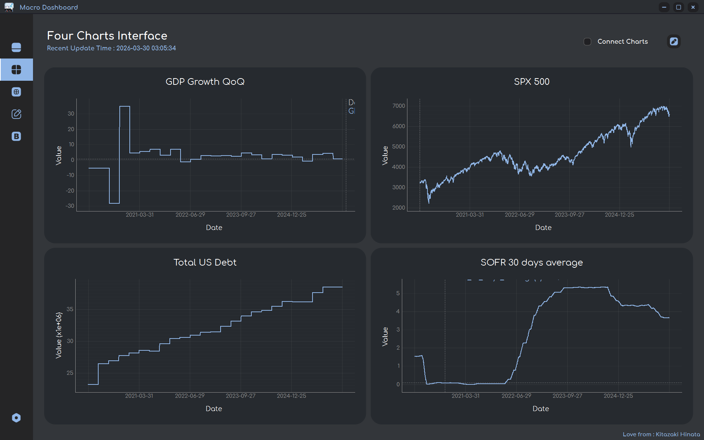
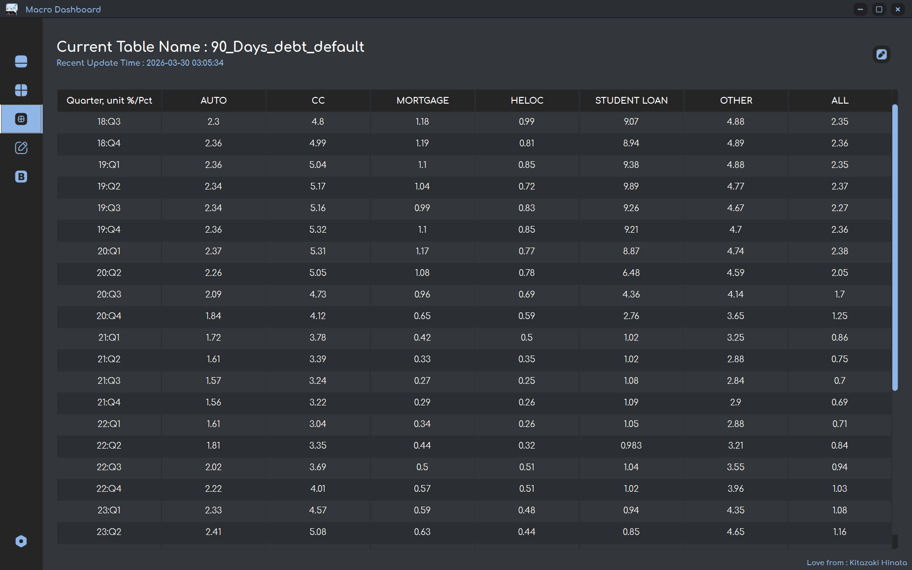
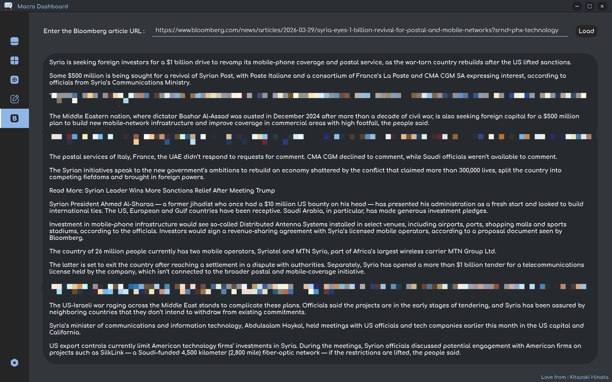

<p align="center">
  
</p>
<h2 align="center">Macro Dashboard</h2>
  <p align="center">轻量级宏观数据分析工作台 | A lightweight desktop workspace for macroeconomic data analysis.</p>


<p align="center">
    简体中文 | <a href="https://github.com/Kitazaki-Hinata/Macro_Dashboard/blob/dev/doc/README_en.md">English</a>
</p>

> Version: v1.0.0

> Author: Kitazaki Hinata, SeaStar, yuyoux7

**<p style="color:red"> - 本程序仅用于学习和学术研究，请遵守目标网站使用条款。</p>**

**<p style="color:red"> - 图表数据仅供分析参考，实际数据请以官方数据源为准。</p>**

**<p style="color:red"> - 使用者应自行承担使用程序的任何风险，作者不对任何使用程序所造成的后果负责。</p>**

**<p style="color:red"> - 本程序所提供的信息不构成任何投资建议。</p>**


### 一、项目说明
Macro Dashboard 是一款基于 Python 与 PySide6 开发的宏观数据分析桌面应用，面向宏观经济学习与研究中的数据整理和探索性分析。项目整合 BEA、FRED、BLS、Yahoo Finance 和 TradingEconomics 等来源的数据，支持数据下载、CSV 导出以及图表与表格展示，减少跨平台收集和整理数据的重复工作。用户可在统一界面中比较不同指标的历史走势，并通过时间偏移辅助观察潜在的领先与滞后关系。
此外，项目提供浏览器辅助的彭博新闻阅读与文本整理功能，将文章页面实际提供的文本整合至工作台，便于结合新闻背景开展宏观分析；内容可用性取决于页面返回的数据，使用时应遵守来源网站的访问权限与使用条款。<br>

程序按数据源组织下载模块，通过统一接口完成数据获取、格式转换与存储，将时间序列数据写入本地 SQLite 数据库（data.db），并使用 PyQtGraph 生成交互式图表。下载结果可保存为 CSV 文件，供后续分析使用。
当前支持的数据以数据清单和项目配置为准，后续将逐步扩展指标覆盖范围。各指标的历史区间、更新频率和统计口径取决于原始数据源，跨指标比较时需注意这些差异。

**下载前请确认网络能够访问所选数据源，必要时配置代理或 VPN。数据下载过程中自动打开的浏览器窗口需保持打开，避免手动操作干扰下载流程。请勿短时间内重复提交下载请求，以免触发数据源的 API 配额或访问频率限制。**

<details>
  <summary>查看程序截图 Screenshot</summary>
    <p align="center">
      
      
      
    </p>
</details>

### 二、准备工作与使用方法（包括环境配置、API Key 获取）

#### 1. 配置 Python 环境

- Python 解释器：3.12

#### 2. 安装依赖

```powershell
# Windows PowerShell  逐步输入
pip install uv
uv sync
```

#### 3. 获取 API Key
请访问以下数据提供方的页面，申请相应的 API Key：
- BEA: https://apps.bea.gov/api/signup/
- FRED St. Louis: https://fredaccount.stlouisfed.org/apikeys
- BLS: https://data.bls.gov/registrationEngine/


#### 4. 运行程序
```powershell
python main.py
```
也可在 Windows 系统中双击运行 main.bat 文件。
- 首次运行时，点击左下角的设置按钮，在左上方的对应字段中填写已申请的 API Key。
- 尚未下载数据时，选择开始年份（当前界面支持的最早年份为 2020 年），阅读并勾选同意使用须知后，点击下载按钮。
- 下载完成后，通过左侧导航栏进入所需界面，在左上角选择要展示的数据并点击确定。


### 三、数据总览

[查看当前已有的数据清单](doc/data_available.html)

#### 部分数据源

- [x] Yahoo Finance API
- [x] BEA API
- [x] FRED API
- [x] BLS API（访问可用性取决于网络环境及数据提供方的访问限制）
- [x] TradingEconomics
- [ ] 其他来源的数据

#### 计划扩展的数据指标

<!-- markdownlint-disable MD033 -->
<details>
  <summary>点击查看详情</summary>

**优先扩展指标**
- [ ] AAII散户投资人情绪指数
- [ ] NAAIM经理人持仓指数
- [ ] 标普PE水平
- [ ] M1与M2剪刀差
- [ ] 周度原油库存、炼油厂利用率

**其他候选指标**
- [ ] 家庭/企业/政府负债比率，流动性指标
- [ ] 经常账户，贸易差额，FDI流入流出（BEA: ITA）
- [ ] 服务贸易（BEA: IntlServTrade）
- [ ] 美元计价的外储（BEA: IIP）
- [ ] 劳动力参与率 (Labor Force Participation Rate)
- [ ] 劳工成本与劳工效率
- [ ] 临时工雇佣数据 (Temporary Help Services Employment)
- [ ] 亚特兰大联储薪资增长追踪 (Wage Growth Tracker)
- [ ] 中间品生产者价格指数 (Intermediate PPI)
- [ ] 标普500企业盈利预期修正比率
- [ ] 主要贸易伙伴国对美出口依存度
- [ ] 供应链压力指数 (如纽约联储的GSCPI)
- [ ] 社会保障与医疗保险支出趋势
- [ ] 企业税收与个人税收占比
- [ ] 抵押贷款申请指数 (MBA Purchase Index)
- [ ] 商业地产价格指数 (如NCREIF)
- [ ] Markit制造业PMI终值
- [ ] OECD美国综合领先指标
- [ ] 经济意外指数 (Citi Economic Surprise Index)
 
 </details>


### 四、软件许可、程序架构与接口说明、其他信息

软件许可：MIT Non-Commercial License（MIT-NC，限非商业用途；具体条款参见根目录 LICENSE 文件）

数据处理程序架构与接口说明：[查看架构文档](doc/structure.md)

BLS 数据代码查询：<https://beta.bls.gov/dataQuery/find>


### 五、待完成事项

<details>
    <summary>点击展开事项</summary>

**待修复问题：**
- [ ] 完善单图视图的数据库列名加载与输入校验，将指标输入限制为有效列名


**计划新增功能：**
- [ ] 为彭博新闻阅读模块添加英译中辅助功能
- [ ] 完善新闻阅读模块在访问受限或需要人工验证时的提示与异常处理
- [ ] 新增美债期限结构展示模块
- [ ] 支持设置图表网格的透明度与颜色
- [ ] 添加使用说明页面
- [ ] 为表格组件添加复制与粘贴功能


</details>


