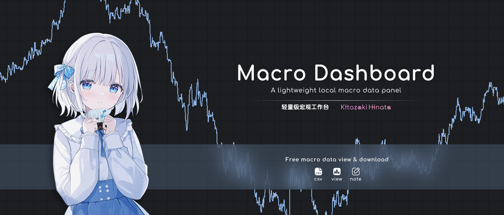

<p align="center">
  
</p>
<h2 align="center">Macro Dashboard</h2>
  <p align="center">A free macro data visualization software.</p>


<p align="center">
    English | <a href="https://github.com/Kitazaki-Hinata/Macro_Dashboard/tree/dev?tab=readme-ov-file">简体中文</a>
</p>

> Author: Kitazaki Hinata, SeaStar, yuyoux7

**<p style="color:red"> - This program is for learning and academic research purposes ONLY. Please comply with the terms of use of the target websites.</p>**

**<p style="color:red"> - Chart data is for analytical reference only. Actual data should be verified with official data sources.</p>**

**<p style="color:red"> - Users are responsible for any risks associated with using the program. The author is not liable for any consequences resulting from the use of the program.</p>**

**<p style="color:red"> - The information provided by this program does not constitute any investment advice.</p>**


### 1. Project Description

The purpose of this project is to conveniently aggregate different macroeconomic data for comparison (frequently opening various webpages to extract data is too cumbersome).
This project uses scripts to obtain macroeconomic data, downloads the data to a local database (data.db) file, and generates integrated charts.
The available data for download will be continuously updated.


### 2. Preparation and Usage Instructions (Incl. env config, API key acquisition)

#### 1. Python Environment

- Python Interpreter: 3.12

#### 2. Install Dependencies

```powershell
# Windows PowerShell
pip install uv
uv sync
```


#### 3. Obtain API Keys
Please visit the following addresses to obtain free API keys:
```ini
BEA: https://apps.bea.gov/api/signup/
FRED St. Louis: https://fredaccount.stlouisfed.org/apikeys
BLS: https://data.bls.gov/registrationEngine/
```

#### 4. Usage Instructions
Open the software, click the "Settings" button at the bottom of the left sidebar, and fill in the API keys in the corresponding fields. Alternatively, create a new file named .env in the project root directory and write the API keys as follows:

```ini
bea = "XXXXXX-YOUR-API-KEY"
fred = "YOURAPIKEY-123456"
bls = "YOUR-API-KEY-000000"
```
If data has not been downloaded, select the start year (the earliest year currently supported is 2020), check the agreement box, and click the download button to download the data.

After the download is complete, click the buttons on the left sidebar to navigate to the desired interface. Set the data you want to display in the top left corner and click confirm.


### 3. Data Overview
View the current list of available data

#### Partial Data Sources
- Yahoo Finance API
- BEA API
- FRED API
- BLS API (Note: This API requires a non-China IP for access)
- TradingEconomics
- Data from other sources

### 4. Other Information
**Open Source License :** MIT-Non-Commercial license (See LICENSE file in the root directory)

**BLS Data Code Query :** https://beta.bls.gov/dataQuery/find

