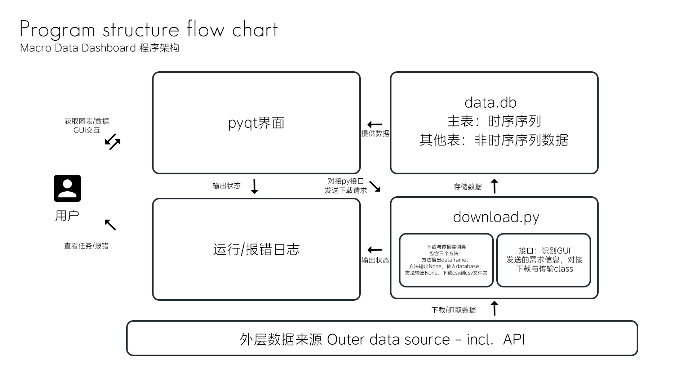

# 程序架构与接口说明
> 作者：Kitazaki Hinata

**序：完整程序结构与流程图**
1. **download.py：通过API或者抓取方式获取数据并存入数据库**
2. data.db：数据库，存储每次下载的数据
3. pyside6 交互界面，数据可视化
4. pyproject.toml 环境依赖配置文档
5. request_id.json 储存用于API请求的参数
6. 其他：日志文件，md文档，架构图与html展示性页面


***
# 程序架构与接口说明

> 作者：Kitazaki Hinata

## 序：完整程序结构与流程图

- download.py：通过 API 或者抓取方式获取数据并存入数据库
- data.db：数据库，存储每次下载的数据
- PySide6 交互界面，数据可视化
- pyproject.toml 环境依赖配置文档
- request_id.json 储存用于 API 请求的参数
- 其他：日志文件、Markdown 文档、架构图与 HTML 展示性页面


***

## Python 脚本架构与 JSON 文件说明

### Python 脚本介绍

- 功能：使用外部 API 或者抓取方式获取数据，并录入数据库/转存为 CSV 格式的数据；提供接口方便请求下载特殊类型的数据。
- 类文件：data_download.py
- 入口：main.py
- 设计架构：简单工厂模式
- 环境与依赖：参考父级目录 pyproject.toml 文件（[查看文件](../pyproject.toml)）
- 报错文件：doc/error.log（[查看文件](error.log)）

### JSON 文件介绍

- 功能：用于储存名称、向外层数据源发送的参数、数据修改方式等数据。
- 主要参数：

```text
name: string，数据名称
code: string，向 API 发送的数据 id
freq: string，数据更新周期（仅在 BEA 类数据存在，格式为 "A"、"Q"、"M" 等）
category: string，数据类（仅在 BEA 类数据存在）
needs_pct: bool，是否需要将数据转换为百分比格式
needs_cleaning: bool，是否需要数据清洗（处理残缺数据）
```

```json
{
  "BEA": {
    "qoq_gdp_growth_q": {
      "name": "GDP Growth QoQ%",
      "code": "T10101",
      "freq": "Q",
      "category": "NIPA",
      "needs_pct": false,
      "needs_cleaning": false
    }
  }
}
```

## DatabaseConverter 方法类：集合所有用于转换成 database 的方法和变量

注：除了 `write_info_db` 函数，其余函数均用于内部调用

- `_convert_month_str_to_num`：将月份字符串转换为数字，内部函数
- `_rename_bea_date_col`：统一时间轴的函数，输入 df，输出修改完日期格式的 df；统一所有的数据时间戳在第一列且名称叫 date
- `_format_converter`：统一数据格式，输入 df，输出统一格式的 df
  - `data_name`：数据名称，用于报错与列名，`table_config["code"]`
  - `is_pct_data`：判断是否是百分比数据，默认为 False，输入 JSON 的 `needs_pct`
- `_create_ts_sheet`：创建 Time_Series 表，如果存在则跳过
- `write_info_db`：封装输出 dataframe 数据到 data.db 数据库，包含统一不同数据 dataframe 的时间戳的功能
  - `data_name`：df 与 db 的列名，以及报错信息
  - `start_date`：起始日期，str 类型而非 date/datetime 类型
  - `is_time_series`：判断是否是时序数据，如果 True 则数据进入 Time_Series 表，否则单独创建新表
  - `is_pct_data`：判断是否是百分比数据，传入 JSON 参数

## DataSource 抽象类：所有实例数据类的基类，定义下载和储存方法

所有继承 DataSource 的实例类必须包含两个方法：

1. `to_db`
   - 功能：将数据传入至 `data.db` 数据库
   - 返回值：None / Dict(name, dataframe)
     - 直接请求该方法，将会直接将数据传入 data.db 然后返回 None；当请求下载 CSV 时，`to_csv` 方法将修改参数 `return_df` 为 True，使该方法返回含 dataframe 的字典

2. `to_csv`
   - 功能：下载 CSV 格式数据到 `csv` 文件夹（后续会修改该方法，通过直接对接 database）
   - 返回值：None

```python
class DataSource(ABC):
    @abstractmethod
    def to_db(self, return_df: bool = False):
        pass

    def to_csv(self) -> None:
        pass
```

## DataSource 实例类：以数据来源为区分，定义多个实例类

实例类数据列表：

| 类名                        | 数据来源说明                    | 数据源简称 `source` 参数 |
|-----------------------------|---------------------------------|--------------------------|
| BEADownloader               | 美国国家统计局 API 数据         | bea                      |
| YFDownloader                | 雅虎 yfinance 美股 API 数据     | yf                       |
| FREDDownloader              | 美国 Federal Reserve API 数据   | fred                     |
| BLSDownloader               | 美国劳工局 API 数据             | bls                      |
| TEDownloader                | TradingEconomics 平台数据       | te                       |
| ISMDownloader               | ISM 美国制造业/服务业数据       | ism                      |
| FedWatchDownloader          | CME FedWatch 数据               | fw                       |
| DallasFedDownloader         | 达拉斯联储制造业数据            | dfm                      |
| NewYorkFedDownloader        | 纽约联储经济数据                | nyf                      |
| InflaNowcastingDownloader   | 克里夫兰联储实时通胀预测数据    | cin                      |
| EminiDownloader             | CME E-mini 期货交易数据         | em                       |
| ForexSwapDownloader         | 外汇掉期数据                    | fs                       |

传入实例类的参数：

1. `json_dict`：从 `request_id.json` 文件中提取的字典格式数据，用于向 API 或者方法传参，输出数据名称
2. `api_key`：从 `.env` 文件中提取出的 API key，用于向 API 请求数据
3. `request_year`：获取数据的起始年份

实例类的方法：

1. `to_db`：将数据写入数据库
   - 注：`return_df` 是类内部参数，返回值变成 dataframe 而不是 None，供下面的 `to_csv` 下载数据用
2. `to_csv`：将数据写入 CSV 文件（后续会修改该方法，通过直接对接 database）

## DownloaderFactory：下载工厂类，统一接口

```python
@classmethod
def create_downloader(
    cls,
    source: str,
    json_data: dict,   # full json data, not just one item in the dict
    request_year: int,
) -> "DataDownloader" | None:
    ...
```

- `_get_api_key`：私有类方法，用于类方法内部调用对应的 API
- `create_downloader`：工厂方法，根据输入参数创建实例类对象并返回
  - `source`：输入数据源简称（参考上文的实例类名表）
  - `json_data`：将 `main.py` 里面的 `json_data` 传出的完整 JSON 文件全部作为参数传入 `create_downloader` 方法，工厂会自动根据传入的 `source` 参数筛选需要的字典并传入实例类

## 接口使用示例

```python
if __name__ == "__main__":
    # initialize
    setup_logging()  # 初始化日志系统
    json_data: dict = read_json()
    request_year: int = 2020  # 请求的开始年份

    # interface
    bea_downloader = DownloaderFactory.create_downloader(
        source="bea",
        json_data=json_data,
        request_year=request_year,
    )
    bea_downloader.to_db()
```
